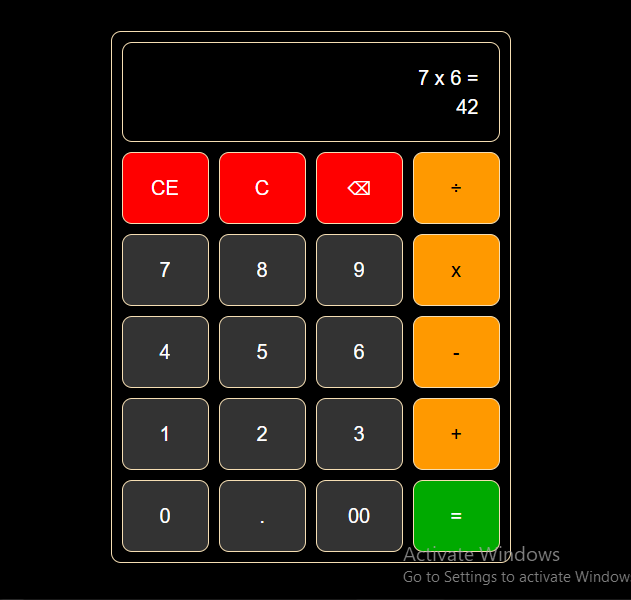

# Calculator

## Overview

This is a simple calculator application built using JavaScript, HTML, and CSS. The calculator allows users to perform basic arithmetic operations such as addition, subtraction, multiplication, and division. It has a clean and interactive user interface, making it easy for users to calculate numbers.

## Table of Content

* [Features](#features)
* [Technologies used](#technologies-used)
* [Installation](#installation)
* [Usage](#usage)
* [Contributing](#contributing)
* [Contact](#contact)

## Features

* Addition: Adds two numbers.
* Subtraction: Subtracts one number from another.
* Multiplication: Multiplies two numbers.
* Division: Divides one number by another (handles division by zero).
* Clear: Clears the current input.
* Decimal Support: Allows input of decimal numbers.

## Technologies Used

* **HTML**: Structure of the web page.
* **CSS**: Styling and layout of the calculator.
* **JavaScript**: Logic for performing calculations and handling user inputs.

## Installation

1. Clone the repository:
   git clone https://github.com/hencci/Calculator-2.git
2. Navigate to the project directory:
   cd Calculator-2
3. Open the index.html file in a web browser.

## Usage

1. Open the application in your browser.
2. Click buttons to input numbers and operations
3. Press 'Equals' (=) to see the result.
4. Click 'Clear' bottons to clear input, or reset the calculator.

### Example Usage

* **Addition**: 5 + 3 = 8
* **Subtraction**: 9 - 4 = 5
* **Multiplication**: 7 * 6 = 42
* **Division**: 8 / 2 = 4

### Screenshot

Here’s a screenshot of the calculator in action:

## Contributing

If you would like to contribute to this project, follow the steps below:

1. Fork the repository.
2. Create a new branch.
3. Make your changes.
4. Test your changes locally.
5. Submit a pull request for review.

## Contact

Created by [Henry Moses](https://github.com/hencci)
Feel free to reach out if you have any questions